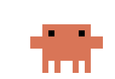

<p align="center">
  
</p>

<h1 align="center">Octopet 🐙</h1>

<p align="center">A tiny pixel octopus that pulls out a laptop and types away on your macOS desktop.</p>

<p align="center"><b>English</b> · <a href="README.md">中文</a></p>

---

I thought Claude's little octopus was adorable, so I asked Opus to make me an identical desktop pet — and now I'm sharing it with everyone.

The animation was recreated frame by frame from a 60 fps recording of the original octopus in the Claude desktop app: rummaging in its pocket, pulling out the laptop, turning around, typing (both hands taking turns while the laptop jiggles), then folding the laptop and stuffing it back. One small extra that the original doesn't have: it gently bobs up and down while idle.

## Install

1. Download `Octopet-vX.Y.Z.zip` from [Releases](../../releases/latest) and unzip it
2. Move `Octopet.app` to your Applications folder
3. The app isn't notarized, so macOS will block the first launch:
   - Go to **System Settings → Privacy & Security** and click **Open Anyway**, or
   - Run `xattr -dr com.apple.quarantine /Applications/Octopet.app`

Requires macOS 11+, runs natively on Apple silicon and Intel.

## Usage

| Action | What happens |
| --- | --- |
| **Click** | Pulls out the laptop and starts typing; click again to put it away |
| **Drag** | Move it anywhere on screen |
| **Right-click** | Size (Original / Bigger / Extra large), Launch at login, Quit |

- It floats above other windows and shows up on every Space
- No Dock icon — to quit, right-click → **Bye, little octopus 👋**
- The menu follows your system language (English / Chinese)

## Build from source

```bash
git clone https://github.com/1zumiii/Octopet.git
cd Octopet
scripts/build.sh        # builds build/Octopet.app and a zip
swift run               # or just run it
```

Requires the Xcode command line tools (Swift 5.7+). `scripts/preview.sh` regenerates the preview GIF above (needs ffmpeg).

## Code structure

Pure Swift + AppKit with no image assets — every pixel is drawn in code:

| File | Purpose |
| --- | --- |
| `Palette.swift` | Colours and canvas size |
| `Painter.swift` | Half-unit rectangle drawing plus body parts (legs, body, laptop) |
| `Frame.swift` | Every pose, as pixel coordinates transcribed from the recording |
| `Animator.swift` | State machine: idle → pull out → typing → put away, at 60 fps |
| `PetView.swift` | Transparent view: drawing, click, drag, right-click menu |
| `Strings.swift` | English / Chinese menu text |
| `LoginItem.swift` | Launch at login (per-user LaunchAgent) |

---

<sub>This is an unofficial fan project and is not affiliated with or endorsed by Anthropic. Claude is a trademark of Anthropic.</sub>

<sub>MIT License</sub>
